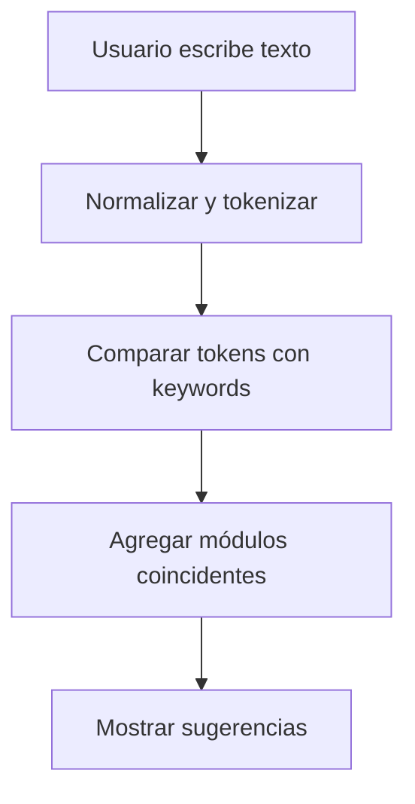

# Sistema de Buscador Semántico

La barra de búsqueda implementa un sistema de **descubrimiento de módulos** inspirado en el funcionamiento de los motores de búsqueda. A partir de lo que escribe el usuario, se interpretan palabras clave y se sugieren las secciones relevantes de la aplicación.

## Objetivo

Construir un mecanismo capaz de **interpretar la intención del usuario** mediante texto libre y ofrecer como resultado los módulos que mejor coincidan.

## Paralelo con los buscadores de Internet

1. **Crawl**: se registran todos los módulos disponibles en el sistema.
2. **Parseo semántico**: cada módulo define palabras clave y descripciones que enriquecen su significado.
3. **Indexación**: se relacionan esas palabras con la intención de los usuarios.
4. **Ranking y sugerencia**: al escribir, se comparan los tokens con el índice semántico y se muestran las coincidencias.

## Proceso lógico

1. **Registro de módulo**: cada entrada del menú incluye un listado de `keywords` representativas.
2. **Entrada del usuario**: la búsqueda se tokeniza y se eliminan stopwords.
3. **Coincidencia**: se normalizan los textos y se buscan coincidencias dentro de los `keywords`, el `label` y la `description` de cada módulo.
4. **Sugerencia**: se presentan las opciones ordenadas según las coincidencias obtenidas.

Este enfoque permite que el buscador reconozca sinónimos y frases comunes sin requerir un procesamiento complejo del lenguaje natural.
